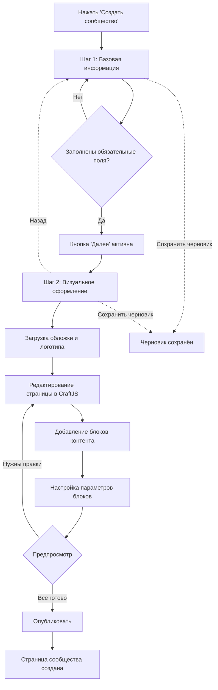

# План переработки страницы создания сообщества

## 📋 Обзор

Переработка процесса создания сообщества в стиле социальных сетей с двухшаговым процессом, расширенными фильтрами и визуальным редактором.

## 🎯 Цели

1. **Упростить процесс создания** - разделить на 2 логических шага
2. **Добавить фильтры аудитории** - "для кого", "я хочу", возраст
3. **Улучшить визуальное оформление** - предпросмотр в реальном времени
4. **Расширить возможности контента** - WYSIWYG редактор, альбомы изображений
5. **Интегрировать рекламу** - блоки продвижения услуг

---

## 🏗️ Архитектура двухшагового процесса

### Шаг 1: Базовая информация и настройки
**URL**: `/dashboard/create-community` (step=1)

#### Секции:

1. **Основная информация**
   - Название сообщества (обязательно)
   - URL-slug (обязательно, автогенерация из названия)
   - Категория (обязательно, выпадающий список)
   - Краткое описание (обязательно, 200 символов)

2. **Расширенное описание**
   - Поле "О сообществе" с WYSIWYG редактором
   - Поддержка форматирования: заголовки, списки, жирный/курсив, ссылки
   - Рекомендуемая библиотека: **TipTap** или **Quill**

3. **Фильтры и аудитория**
   - **"Для кого"** (множественный выбор из списка socialAudience)
     - Чекбоксы с поиском
     - Примеры: "Для родителей с детьми", "Для студентов", "Для всех желающих"
   
   - **"Я хочу"** (множественный выбор из списка wishes)
     - Чекбоксы с поиском
     - Примеры: "Познакомиться", "Учиться", "Творить"
   
   - **Возрастная категория** (множественный выбор)
     - Малыши 0+
     - Младшие школьники 6+
     - Старшие школьники 12+
     - Подростки 16+
     - Взрослые 18+

4. **Локация и контакты**
   - Адрес/район (текстовое поле с автодополнением)
   - Email для связи
   - Телефон (опционально)

5. **Социальные сети** (исключить Instagram)
   - VK
   - Telegram
   - Website
   - Facebook (опционально)

**Кнопки навигации:**
- "Далее" → переход к Шагу 2
- "Сохранить черновик" → сохранение без публикации

---

### Шаг 2: Визуальное оформление и контент
**URL**: `/dashboard/create-community` (step=2)

#### Режимы отображения:

**Режим редактирования** (по умолчанию):
- Левая панель: Toolbox с блоками
- Центр: Предпросмотр страницы сообщества с элементами управления
- Правая панель: Настройки выбранного блока

**Режим предпросмотра**:
- Полноэкранный вид страницы как для обычного посетителя
- Кнопка "Вернуться к редактированию"

#### Секции редактирования:

1. **Визуальные элементы**
   - **Обложка** (1200x400px)
     - Загрузка изображения
     - Кроппер для подгонки размера
     - Предпросмотр в реальном времени
   
   - **Логотип/Иконка** (400x400px)
     - Загрузка изображения
     - Круглая обрезка
     - Предпросмотр в реальном времени

2. **Редактор главной страницы (CraftJS)**
   
   **Существующие блоки:**
   - Контейнер
   - Заголовок (H1-H6)
   - Текст
   - Кнопка
   - Изображение
   - Карточка

   **Новые блоки для добавления:**
   
   - **Карусель изображений**
     - Управление альбомами
     - Загрузка множественных изображений
     - Настройки: автопрокрутка, индикаторы, стрелки
     - Подписи к изображениям
   
   - **Видео-блок**
     - Встраивание YouTube/Vimeo
     - Настройки: автовоспроизведение, размер
   
   - **Блок статистики**
     - Счетчики с иконками
     - Настройки: количество колонок, цвета
     - Примеры: участники, события, годы работы
   
   - **Блок команды**
     - Сетка карточек участников
     - Фото, имя, роль, описание
     - Социальные ссылки
   
   - **Блок предстоящих событий**
     - Автоматическая подгрузка событий сообщества
     - Настройки: количество, стиль отображения
   
   - **Разделитель**
     - Горизонтальная линия
     - Настройки: стиль, цвет, отступы

3. **Улучшенная панель настроек блоков**
   
   Для каждого блока добавить:
   - **Отступы** (margin, padding)
   - **Выравнивание** (left, center, right)
   - **Фон** (цвет, градиент, изображение)
   - **Границы** (цвет, толщина, радиус)
   - **Тени** (box-shadow)
   - **Анимации** (fade-in, slide-in)
   - **Видимость** (показать/скрыть на мобильных)

4. **Рекламные блоки** (фиксированные, нередактируемые)
   
   **Блок 1: Лендинг-услуги**
   ```
   📱 Хочешь красивый лендинг для своего проекта?
   Обращайся к нам! Создадим уникальный дизайн.
   [Узнать подробнее →]
   ```
   
   **Блок 2: Радио-реклама**
   ```
   📻 Продвижение сообщества на Иркутском радио!
   Расскажи о своих событиях тысячам слушателей.
   [Заказать эфир →]
   ```
   
   Размещение: внизу страницы, перед футером

**Кнопки навигации:**
- "← Назад" → возврат к Шагу 1
- "Предпросмотр" → переключение режима
- "Сохранить черновик"
- "Опубликовать сообщество" → финальная публикация

---

## 📊 Схема данных

### Расширенная модель Community

```typescript
interface Community {
  // Существующие поля
  id: string;
  owner_id: string;
  name: string;
  slug: string;
  description: string; // краткое описание
  avatar_url: string;
  cover_url: string;
  category_id: string;
  members_count: number;
  location: string;
  website?: string;
  social_links?: SocialLinks;
  contact_email?: string;
  contact_phone?: string;
  is_verified: boolean;
  is_published: boolean;
  created_at: string;
  updated_at: string;
  
  // Новые поля
  full_description?: string; // WYSIWYG контент
  target_audience?: string[]; // "для кого"
  wishes?: string[]; // "я хочу"
  age_categories?: string[]; // возрастные категории
  page_content?: string; // JSON CraftJS
  photo_albums?: PhotoAlbum[];
  draft_step?: number; // текущий шаг черновика (1 или 2)
}

interface SocialLinks {
  vk?: string;
  telegram?: string;
  website?: string;
  facebook?: string;
  // instagram удален
}

interface PhotoAlbum {
  id: string;
  title: string;
  description?: string;
  photos: Photo[];
  created_at: string;
  is_featured: boolean; // показывать на главной
}

interface Photo {
  id: string;
  url: string;
  thumbnail_url: string;
  caption?: string;
  order: number;
}
```

---

## 🎨 UI/UX Компоненты

### Новые компоненты для создания

1. **`<StepIndicator />`**
   - Визуальный индикатор текущего шага (1/2)
   - Клик по шагу для навигации (если шаг пройден)

2. **`<FilterSelector />`**
   - Компонент множественного выбора с поиском
   - Используется для "для кого", "я хочу", возраста
   - Показывает выбранные элементы как теги

3. **`<WYSIWYGEditor />`**
   - Интеграция TipTap или Quill
   - Панель инструментов: заголовки, списки, форматирование, ссылки
   - Предпросмотр в реальном времени

4. **`<ImageUploader />`**
   - Drag & drop загрузка
   - Кроппер для обрезки
   - Предпросмотр
   - Прогресс загрузки

5. **`<AlbumManager />`**
   - Создание/редактирование альбомов
   - Множественная загрузка фото
   - Drag & drop для сортировки
   - Настройка обложки альбома

6. **`<CarouselBlock />` (CraftJS компонент)**
   - Отображение карусели изображений
   - Настройки в SettingsPanel
   - Выбор альбома для отображения

7. **`<VideoBlock />` (CraftJS компонент)**
   - Встраивание видео по URL
   - Поддержка YouTube, Vimeo
   - Настройки размера и автовоспроизведения

8. **`<StatsBlock />` (CraftJS компонент)**
   - Блок со статистикой
   - Настраиваемые счетчики
   - Иконки и цвета

9. **`<TeamBlock />` (CraftJS компонент)**
   - Сетка карточек команды
   - Управление участниками
   - Фото, роль, описание

10. **`<EventsWidget />` (CraftJS компонент)**
    - Автоматическая подгрузка событий
    - Различные стили отображения
    - Фильтрация по датам

11. **`<EnhancedSettingsPanel />`**
    - Расширенная панель настроек
    - Вкладки: Контент, Стиль, Расширенное
    - Визуальные контролы для отступов, цветов, теней

12. **`<AdvertisementBlock />`**
    - Нередактируемый рекламный блок
    - Два варианта: лендинг и радио
    - Стильный дизайн с CTA кнопками

---

## 🔄 Пользовательский Flow



---

## 🛠️ Технические детали

### Библиотеки для добавления

```json
{
  "dependencies": {
    "@tiptap/react": "^2.x",
    "@tiptap/starter-kit": "^2.x",
    "react-image-crop": "^11.x",
    "swiper": "^11.x",
    "react-dropzone": "^14.x"
  }
}
```

### Структура файлов

```
app/dashboard/create-community/
├── page.tsx                          # Главный компонент с роутингом шагов
├── components/
│   ├── StepIndicator.tsx
│   ├── Step1BasicInfo.tsx
│   ├── Step2VisualDesign.tsx
│   ├── FilterSelector.tsx
│   ├── WYSIWYGEditor.tsx
│   ├── ImageUploader.tsx
│   └── AlbumManager.tsx
│
components/page-builder/
├── blocks/
│   ├── CarouselBlock.tsx
│   ├── VideoBlock.tsx
│   ├── StatsBlock.tsx
│   ├── TeamBlock.tsx
│   ├── EventsWidget.tsx
│   └── DividerBlock.tsx
├── EnhancedSettingsPanel.tsx
├── AdvertisementBlock.tsx
└── Toolbox.tsx                       # Обновить с новыми блоками
```

---

## 📝 Детальная спецификация компонентов

### 1. StepIndicator

```typescript
interface StepIndicatorProps {
  currentStep: 1 | 2;
  completedSteps: number[];
  onStepClick: (step: number) => void;
}
```

**Функционал:**
- Показывает текущий шаг
- Отмечает завершенные шаги
- Позволяет переходить к завершенным шагам

---

### 2. FilterSelector

```typescript
interface FilterSelectorProps {
  label: string;
  options: string[];
  selected: string[];
  onChange: (selected: string[]) => void;
  searchable?: boolean;
  maxHeight?: string;
}
```

**Функционал:**
- Поиск по опциям
- Множественный выбор
- Отображение выбранных как теги
- Удаление тегов

---

### 3. WYSIWYGEditor

```typescript
interface WYSIWYGEditorProps {
  content: string;
  onChange: (content: string) => void;
  placeholder?: string;
  minHeight?: string;
}
```

**Возможности:**
- Заголовки (H1-H6)
- Жирный, курсив, подчеркнутый
- Списки (маркированные, нумерованные)
- Ссылки
- Цитаты
- Код

---

### 4. CarouselBlock (CraftJS)

```typescript
interface CarouselBlockProps {
  albumId?: string;
  autoplay?: boolean;
  interval?: number;
  showIndicators?: boolean;
  showArrows?: boolean;
  height?: string;
}
```

**Настройки:**
- Выбор альбома из списка
- Автопрокрутка (вкл/выкл)
- Интервал автопрокрутки
- Показ индикаторов
- Показ стрелок навигации
- Высота карусели

---

### 5. AlbumManager

```typescript
interface Album {
  id: string;
  title: string;
  description?: string;
  photos: Photo[];
  coverPhotoId?: string;
}

interface AlbumManagerProps {
  albums: Album[];
  onAlbumsChange: (albums: Album[]) => void;
}
```

**Функционал:**
- Создание нового альбома
- Редактирование альбома
- Удаление альбома
- Загрузка фото (множественная)
- Drag & drop сортировка фото
- Установка обложки альбома
- Добавление подписей к фото

---

### 6. EnhancedSettingsPanel

**Вкладки:**

**Контент:**
- Специфичные настройки блока (текст, изображения и т.д.)

**Стиль:**
- Отступы (margin, padding) - визуальный контрол
- Выравнивание (left, center, right, justify)
- Фон (цвет, градиент, изображение)
- Границы (цвет, толщина, радиус)
- Тени (box-shadow) - визуальный контрол

**Расширенное:**
- Анимации (fade-in, slide-in, bounce)
- Видимость на устройствах
- Пользовательский CSS класс
- Z-index

---

### 7. AdvertisementBlock

**Вариант 1: Лендинг**
```tsx
<div className="bg-gradient-to-r from-blue-500 to-purple-600 rounded-xl p-6 text-white">
  <div className="flex items-center gap-4">
    <div className="text-4xl">📱</div>
    <div className="flex-1">
      <h3 className="font-bold text-lg mb-1">
        Хочешь красивый лендинг для своего проекта?
      </h3>
      <p className="text-sm opacity-90">
        Обращайся к нам! Создадим уникальный дизайн.
      </p>
    </div>
    <button className="bg-white text-blue-600 px-6 py-3 rounded-lg font-semibold hover:bg-gray-100 transition">
      Узнать подробнее →
    </button>
  </div>
</div>
```

**Вариант 2: Радио**
```tsx
<div className="bg-gradient-to-r from-orange-500 to-red-600 rounded-xl p-6 text-white">
  <div className="flex items-center gap-4">
    <div className="text-4xl">📻</div>
    <div className="flex-1">
      <h3 className="font-bold text-lg mb-1">
        Продвижение сообщества на Иркутском радио!
      </h3>
      <p className="text-sm opacity-90">
        Расскажи о своих событиях тысячам слушателей.
      </p>
    </div>
    <button className="bg-white text-orange-600 px-6 py-3 rounded-lg font-semibold hover:bg-gray-100 transition">
      Заказать эфир →
    </button>
  </div>
</div>
```

---

## 🎯 Приоритеты реализации

### Фаза 1: Базовая структура (Высокий приоритет)
1. ✅ Двухшаговая навигация
2. ✅ StepIndicator компонент
3. ✅ Шаг 1: Базовая информация
4. ✅ FilterSelector для фильтров
5. ✅ Интеграция WYSIWYG редактора

### Фаза 2: Визуальное оформление (Высокий приоритет)
1. ✅ Шаг 2: Визуальный редактор
2. ✅ ImageUploader с кроппером
3. ✅ Предпросмотр в реальном времени
4. ✅ Рекламные блоки

### Фаза 3: Расширенные блоки (Средний приоритет)
1. ✅ CarouselBlock + AlbumManager
2. ✅ VideoBlock
3. ✅ StatsBlock
4. ✅ EnhancedSettingsPanel

### Фаза 4: Дополнительные возможности (Низкий приоритет)
1. ⏳ TeamBlock
2. ⏳ EventsWidget
3. ⏳ Анимации блоков
4. ⏳ Адаптивность настроек

---

## 🔐 Валидация и сохранение

### Шаг 1 - Обязательные поля:
- Название (мин. 3 символа)
- Slug (уникальный, только латиница и дефисы)
- Категория
- Краткое описание (мин. 20, макс. 200 символов)
- Email (валидный формат)

### Шаг 2 - Рекомендуемые:
- Обложка (желательно)
- Логотип (желательно)
- Хотя бы один контентный блок

### Сохранение черновика:
- Автосохранение каждые 30 секунд
- Ручное сохранение по кнопке
- Сохранение текущего шага
- Возможность продолжить с любого шага

---

## 📱 Адаптивность

### Десктоп (>1024px):
- Трехколоночный layout (Toolbox | Canvas | Settings)
- Полная функциональность

### Планшет (768-1024px):
- Двухколоночный layout (Canvas | Settings)
- Toolbox в выдвижной панели

### Мобильный (<768px):
- Одноколоночный layout
- Все панели в модальных окнах
- Упрощенный редактор

---

## 🎨 Дизайн-система

### Цвета:
- Primary: Emerald (как в текущем дизайне)
- Secondary: Blue
- Accent: Purple (для рекламы)
- Success: Green
- Warning: Orange
- Error: Red

### Типографика:
- Заголовки: font-bold
- Основной текст: font-normal
- Подписи: font-medium text-sm

### Отступы:
- Малые: 0.5rem (8px)
- Средние: 1rem (16px)
- Большие: 1.5rem (24px)
- XL: 2rem (32px)

---

## 🚀 Следующие шаги

1. **Создать прототип** в Figma/Sketch (опционально)
2. **Реализовать Фазу 1** - базовая структура
3. **Тестирование** UX с реальными пользователями
4. **Реализовать Фазу 2** - визуальное оформление
5. **Реализовать Фазу 3** - расширенные блоки
6. **Оптимизация** производительности
7. **Документация** для пользователей

---

## 📚 Дополнительные ресурсы

- [TipTap Documentation](https://tiptap.dev/)
- [CraftJS Documentation](https://craft.js.org/)
- [Swiper Documentation](https://swiperjs.com/)
- [React Image Crop](https://github.com/DominicTobias/react-image-crop)

---

**Дата создания:** 2025-11-20  
**Версия:** 1.0  
**Автор:** Kilo Code (Architect Mode)