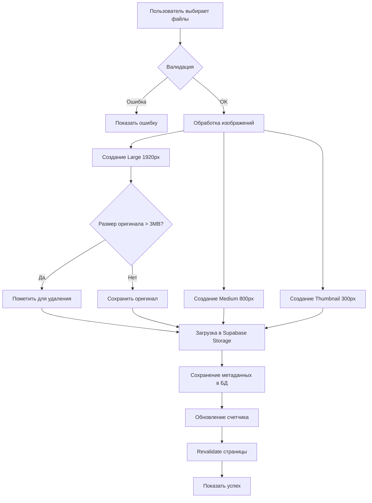

# 📸 Архитектура медиабиблиотеки

## 📋 Содержание

1. [Обзор системы](#обзор-системы)
2. [Требования](#требования)
3. [Архитектура базы данных](#архитектура-базы-данных)
4. [Хранение изображений](#хранение-изображений)
5. [Обработка и сжатие изображений](#обработка-и-сжатие-изображений)
6. [UI/UX компоненты](#uiux-компоненты)
7. [API и Server Actions](#api-и-server-actions)
8. [Workflow загрузки](#workflow-загрузки)
9. [Best Practices](#best-practices)
10. [Диаграммы](#диаграммы)

---

## 🎯 Обзор системы

Медиабиблиотека - это система управления изображениями для сообществ и экспертов, позволяющая:
- Загружать и хранить фотографии
- Автоматически оптимизировать изображения
- Выбирать фото для отображения на публичных страницах
- Показывать фото в виде каруселей на страницах сообществ и мероприятий

### Ключевые особенности

✅ **Drag & Drop загрузка** - интуитивный интерфейс  
✅ **Множественная загрузка** - до 10 файлов одновременно  
✅ **Автоматическое сжатие** - 3 размера изображений  
✅ **Умное хранение** - удаление оригиналов >3MB  
✅ **Галочки публикации** - выбор фото для показа на странице  
✅ **Карусель** - красивое отображение на публичных страницах  

---

## 📝 Требования

### Функциональные требования

1. **Пользователи:**
   - Владельцы сообществ могут управлять медиабиблиотекой своего сообщества
   - Эксперты могут управлять своей медиабиблиотекой

2. **Загрузка:**
   - Drag & Drop интерфейс
   - Множественная загрузка (до 10 файлов)
   - Поддержка форматов: JPG, PNG, WebP
   - Максимальный размер файла: 10MB

3. **Хранение:**
   - Лимит: 200 фото на сообщество/эксперта
   - Автоматическое создание 3 размеров
   - Удаление оригиналов >3MB

4. **Публикация:**
   - Выбор фото галочками для показа на странице
   - Отображение в виде карусели
   - Возможность добавить подпись к фото

### Технические требования

1. **Производительность:**
   - Загрузка изображения: <5 секунд
   - Обработка и сжатие: <10 секунд
   - Загрузка карусели: <2 секунды

2. **Размеры изображений:**
   - **Large:** 1920px (длинная сторона) - для просмотра
   - **Medium:** 800px (длинная сторона) - для карусели
   - **Thumbnail:** 300px (длинная сторона) - для превью

3. **Безопасность:**
   - Только владелец может управлять медиабиблиотекой
   - Валидация типов файлов
   - Защита от вредоносных файлов

---

## 🗄️ Архитектура базы данных

### Таблица: media_library

```sql
-- Таблица медиабиблиотеки
create table media_library (
  id uuid default uuid_generate_v4() primary key,
  
  -- Владелец (сообщество или эксперт)
  owner_type text check (owner_type in ('community', 'expert')) not null,
  owner_id uuid not null,
  
  -- Метаданные изображения
  title text,
  description text,
  alt_text text,
  
  -- URLs для разных размеров
  url_large text not null,      -- 1920px
  url_medium text not null,     -- 800px
  url_thumbnail text not null,  -- 300px
  
  -- Пути в Storage (для удаления)
  storage_path_large text not null,
  storage_path_medium text not null,
  storage_path_thumbnail text not null,
  
  -- Информация о файле
  original_filename text not null,
  file_size_bytes bigint not null,  -- размер оригинала
  mime_type text not null,
  width int,
  height int,
  
  -- Публикация
  is_published boolean default false,  -- показывать на странице
  display_order int default 0,        -- порядок в карусели
  
  -- Временные метки
  uploaded_at timestamp with time zone default timezone('utc'::text, now()) not null,
  updated_at timestamp with time zone default timezone('utc'::text, now()) not null,
  
  -- Индексы
  constraint media_library_owner_check check (
    (owner_type = 'community' and owner_id in (select id from communities)) or
    (owner_type = 'expert' and owner_id in (select id from experts))
  )
);

-- Индексы для производительности
create index media_library_owner_idx on media_library(owner_type, owner_id);
create index media_library_published_idx on media_library(owner_type, owner_id, is_published);
create index media_library_display_order_idx on media_library(owner_type, owner_id, display_order);

-- Триггер для обновления updated_at
create trigger update_media_library_updated_at 
  before update on media_library
  for each row 
  execute procedure update_updated_at_column();

-- Row Level Security
alter table media_library enable row level security;

-- Политика: все могут читать опубликованные
create policy "Published media is viewable by everyone"
  on media_library for select
  using (is_published = true);

-- Политика: владельцы могут управлять своими медиа
create policy "Owners can manage their media"
  on media_library for all
  using (
    (owner_type = 'community' and owner_id in (
      select id from communities where owner_id = auth.uid()
    ))
    or
    (owner_type = 'expert' and owner_id in (
      select id from experts where profile_id = auth.uid()
    ))
  );

-- Функция для подсчета медиа
create or replace function count_media_for_owner(
  p_owner_type text,
  p_owner_id uuid
)
returns int as $$
  select count(*)::int
  from media_library
  where owner_type = p_owner_type
    and owner_id = p_owner_id;
$$ language sql stable;

-- Функция для проверки лимита
create or replace function check_media_limit()
returns trigger as $$
begin
  if (select count_media_for_owner(new.owner_type, new.owner_id)) >= 200 then
    raise exception 'Media library limit reached (200 items)';
  end if;
  return new;
end;
$$ language plpgsql;

-- Триггер для проверки лимита
create trigger check_media_limit_trigger
  before insert on media_library
  for each row
  execute procedure check_media_limit();
```

### Обновление существующих таблиц

```sql
-- Добавить поле для медиабиблиотеки в communities
alter table communities 
  add column if not exists media_count int default 0;

-- Добавить поле для медиабиблиотеки в experts
alter table experts 
  add column if not exists media_count int default 0;

-- Триггер для обновления счетчика при добавлении
create or replace function update_media_count_on_insert()
returns trigger as $$
begin
  if new.owner_type = 'community' then
    update communities 
    set media_count = media_count + 1 
    where id = new.owner_id;
  elsif new.owner_type = 'expert' then
    update experts 
    set media_count = media_count + 1 
    where id = new.owner_id;
  end if;
  return new;
end;
$$ language plpgsql;

create trigger media_count_insert_trigger
  after insert on media_library
  for each row
  execute procedure update_media_count_on_insert();

-- Триггер для обновления счетчика при удалении
create or replace function update_media_count_on_delete()
returns trigger as $$
begin
  if old.owner_type = 'community' then
    update communities 
    set media_count = media_count - 1 
    where id = old.owner_id;
  elsif old.owner_type = 'expert' then
    update experts 
    set media_count = media_count - 1 
    where id = old.owner_id;
  end if;
  return old;
end;
$$ language plpgsql;

create trigger media_count_delete_trigger
  after delete on media_library
  for each row
  execute procedure update_media_count_on_delete();
```

---

## 📦 Хранение изображений

### Структура Supabase Storage

```
Buckets:
├── media-library/
│   ├── communities/
│   │   ├── {community_id}/
│   │   │   ├── large/
│   │   │   │   └── {uuid}.webp
│   │   │   ├── medium/
│   │   │   │   └── {uuid}.webp
│   │   │   └── thumbnails/
│   │   │       └── {uuid}.webp
│   └── experts/
│       ├── {expert_id}/
│       │   ├── large/
│       │   │   └── {uuid}.webp
│       │   ├── medium/
│       │   │   └── {uuid}.webp
│       │   └── thumbnails/
│       │       └── {uuid}.webp
```

### Настройка Storage Bucket

```typescript
// Создать bucket в Supabase Dashboard или через SQL
insert into storage.buckets (id, name, public)
values ('media-library', 'media-library', true);

// Политики доступа
create policy "Public read access"
  on storage.objects for select
  using (bucket_id = 'media-library');

create policy "Authenticated users can upload"
  on storage.objects for insert
  with check (
    bucket_id = 'media-library' 
    and auth.role() = 'authenticated'
  );

create policy "Users can delete own media"
  on storage.objects for delete
  using (
    bucket_id = 'media-library'
    and auth.uid()::text = (storage.foldername(name))[1]
  );
```

### Именование файлов

```typescript
// Формат: {uuid}.webp
// Пример: 
// large/a1b2c3d4-e5f6-7890-abcd-ef1234567890.webp
// medium/a1b2c3d4-e5f6-7890-abcd-ef1234567890.webp
// thumbnails/a1b2c3d4-e5f6-7890-abcd-ef1234567890.webp
```

---

## 🔄 Обработка и сжатие изображений

### Технологический стек

**Вариант 1: Browser-side (рекомендуется для начала)**
- Библиотека: `browser-image-compression`
- Преимущества: не нагружает сервер, быстрая обработка
- Недостатки: зависит от мощности устройства пользователя

**Вариант 2: Server-side (для production)**
- Edge Function с `sharp` или `imageMagick`
- Преимущества: стабильное качество, контроль над процессом
- Недостатки: требует настройки Edge Functions

### Алгоритм обработки (Browser-side)

```typescript
// lib/utils/image-processing.ts
import imageCompression from 'browser-image-compression';

export interface ProcessedImage {
  large: File;
  medium: File;
  thumbnail: File;
  shouldDeleteOriginal: boolean;
}

export async function processImage(file: File): Promise<ProcessedImage> {
  const originalSizeMB = file.size / 1024 / 1024;
  
  // Опции для разных размеров
  const largeOptions = {
    maxSizeMB: 2,
    maxWidthOrHeight: 1920,
    useWebWorker: true,
    fileType: 'image/webp',
  };
  
  const mediumOptions = {
    maxSizeMB: 0.5,
    maxWidthOrHeight: 800,
    useWebWorker: true,
    fileType: 'image/webp',
  };
  
  const thumbnailOptions = {
    maxSizeMB: 0.1,
    maxWidthOrHeight: 300,
    useWebWorker: true,
    fileType: 'image/webp',
  };
  
  // Параллельная обработка
  const [large, medium, thumbnail] = await Promise.all([
    imageCompression(file, largeOptions),
    imageCompression(file, mediumOptions),
    imageCompression(file, thumbnailOptions),
  ]);
  
  return {
    large,
    medium,
    thumbnail,
    shouldDeleteOriginal: originalSizeMB > 3,
  };
}

// Получить размеры изображения
export async function getImageDimensions(file: File): Promise<{ width: number; height: number }> {
  return new Promise((resolve, reject) => {
    const img = new Image();
    img.onload = () => {
      resolve({ width: img.width, height: img.height });
    };
    img.onerror = reject;
    img.src = URL.createObjectURL(file);
  });
}

// Валидация файла
export function validateImageFile(file: File): { valid: boolean; error?: string } {
  const maxSize = 10 * 1024 * 1024; // 10MB
  const allowedTypes = ['image/jpeg', 'image/png', 'image/webp'];
  
  if (!allowedTypes.includes(file.type)) {
    return { valid: false, error: 'Неподдерживаемый формат. Используйте JPG, PNG или WebP' };
  }
  
  if (file.size > maxSize) {
    return { valid: false, error: 'Файл слишком большой. Максимум 10MB' };
  }
  
  return { valid: true };
}
```

### Алгоритм обработки (Server-side Edge Function)

```typescript
// supabase/functions/process-image/index.ts
import { serve } from 'https://deno.land/std@0.168.0/http/server.ts';
import { createClient } from 'https://esm.sh/@supabase/supabase-js@2';
import { Image } from 'https://deno.land/x/imagescript@1.2.15/mod.ts';

serve(async (req) => {
  try {
    const { imageUrl, sizes } = await req.json();
    
    // Скачать оригинал
    const response = await fetch(imageUrl);
    const arrayBuffer = await response.arrayBuffer();
    const image = await Image.decode(new Uint8Array(arrayBuffer));
    
    const results = {};
    
    // Обработать каждый размер
    for (const [name, maxSize] of Object.entries(sizes)) {
      const resized = image.resize(maxSize, Image.RESIZE_AUTO);
      const encoded = await resized.encodeWebP(85); // качество 85%
      results[name] = encoded;
    }
    
    return new Response(JSON.stringify(results), {
      headers: { 'Content-Type': 'application/json' },
    });
  } catch (error) {
    return new Response(JSON.stringify({ error: error.message }), {
      status: 500,
      headers: { 'Content-Type': 'application/json' },
    });
  }
});
```

---

## 🎨 UI/UX компоненты

### 1. Компонент загрузки (MediaUploader)

```typescript
// components/media/MediaUploader.tsx
'use client';

import { useState, useCallback } from 'react';
import { useDropzone } from 'react-dropzone';
import { processImage, validateImageFile } from '@/lib/utils/image-processing';
import { uploadMediaToLibrary } from '@/app/actions/media';

interface MediaUploaderProps {
  ownerType: 'community' | 'expert';
  ownerId: string;
  currentCount: number;
  maxCount?: number;
  onUploadComplete?: () => void;
}

export function MediaUploader({
  ownerType,
  ownerId,
  currentCount,
  maxCount = 200,
  onUploadComplete,
}: MediaUploaderProps) {
  const [uploading, setUploading] = useState(false);
  const [progress, setProgress] = useState<Record<string, number>>({});
  const [errors, setErrors] = useState<string[]>([]);

  const onDrop = useCallback(async (acceptedFiles: File[]) => {
    // Проверка лимита
    if (currentCount + acceptedFiles.length > maxCount) {
      setErrors([`Превышен лимит. Можно загрузить еще ${maxCount - currentCount} фото`]);
      return;
    }

    // Проверка количества файлов за раз
    if (acceptedFiles.length > 10) {
      setErrors(['Можно загрузить максимум 10 файлов за раз']);
      return;
    }

    setUploading(true);
    setErrors([]);
    const newProgress: Record<string, number> = {};

    for (const file of acceptedFiles) {
      try {
        // Валидация
        const validation = validateImageFile(file);
        if (!validation.valid) {
          setErrors(prev => [...prev, `${file.name}: ${validation.error}`]);
          continue;
        }

        // Обработка изображения
        newProgress[file.name] = 10;
        setProgress({ ...newProgress });

        const processed = await processImage(file);
        
        newProgress[file.name] = 50;
        setProgress({ ...newProgress });

        // Загрузка
        await uploadMediaToLibrary({
          ownerType,
          ownerId,
          files: processed,
          metadata: {
            originalFilename: file.name,
            mimeType: file.type,
          },
        });

        newProgress[file.name] = 100;
        setProgress({ ...newProgress });

      } catch (error) {
        setErrors(prev => [...prev, `${file.name}: ${error.message}`]);
      }
    }

    setUploading(false);
    onUploadComplete?.();
  }, [ownerType, ownerId, currentCount, maxCount, onUploadComplete]);

  const { getRootProps, getInputProps, isDragActive } = useDropzone({
    onDrop,
    accept: {
      'image/jpeg': ['.jpg', '.jpeg'],
      'image/png': ['.png'],
      'image/webp': ['.webp'],
    },
    maxFiles: 10,
    disabled: uploading || currentCount >= maxCount,
  });

  return (
    <div className="space-y-4">
      {/* Dropzone */}
      <div
        {...getRootProps()}
        className={`
          border-2 border-dashed rounded-xl p-12 text-center cursor-pointer
          transition-all duration-200
          ${isDragActive 
            ? 'border-blue-500 bg-blue-50 dark:bg-blue-900/20' 
            : 'border-gray-300 dark:border-neutral-600 hover:border-blue-400'
          }
          ${uploading ? 'opacity-50 cursor-not-allowed' : ''}
        `}
      >
        <input {...getInputProps()} />
        
        <div className="flex flex-col items-center gap-4">
          <svg className="w-16 h-16 text-gray-400" fill="none" stroke="currentColor" viewBox="0 0 24 24">
            <path strokeLinecap="round" strokeLinejoin="round" strokeWidth={1.5} d="M7 16a4 4 0 01-.88-7.903A5 5 0 1115.9 6L16 6a5 5 0 011 9.9M15 13l-3-3m0 0l-3 3m3-3v12" />
          </svg>
          
          <div>
            <p className="text-lg font-medium text-gray-900 dark:text-white">
              {isDragActive ? 'Отпустите файлы здесь' : 'Перетащите фото сюда'}
            </p>
            <p className="text-sm text-gray-500 dark:text-neutral-400 mt-1">
              или нажмите для выбора файлов
            </p>
            <p className="text-xs text-gray-400 dark:text-neutral-500 mt-2">
              JPG, PNG, WebP до 10MB • Максимум 10 файлов за раз
            </p>
          </div>
          
          <div className="text-sm text-gray-600 dark:text-neutral-400">
            Загружено: {currentCount} / {maxCount}
          </div>
        </div>
      </div>

      {/* Progress */}
      {uploading && Object.keys(progress).length > 0 && (
        <div className="space-y-2">
          <p className="text-sm font-medium text-gray-700 dark:text-neutral-300">
            Загрузка файлов...
          </p>
          {Object.entries(progress).map(([filename, percent]) => (
            <div key={filename} className="space-y-1">
              <div className="flex justify-between text-xs text-gray-600 dark:text-neutral-400">
                <span className="truncate max-w-xs">{filename}</span>
                <span>{percent}%</span>
              </div>
              <div className="w-full bg-gray-200 dark:bg-neutral-700 rounded-full h-2">
                <div
                  className="bg-blue-600 h-2 rounded-full transition-all duration-300"
                  style={{ width: `${percent}%` }}
                />
              </div>
            </div>
          ))}
        </div>
      )}

      {/* Errors */}
      {errors.length > 0 && (
        <div className="bg-red-50 dark:bg-red-900/20 border border-red-200 dark:border-red-800 rounded-lg p-4">
          <p className="text-sm font-medium text-red-800 dark:text-red-300 mb-2">
            Ошибки при загрузке:
          </p>
          <ul className="text-sm text-red-700 dark:text-red-400 space-y-1">
            {errors.map((error, i) => (
              <li key={i}>• {error}</li>
            ))}
          </ul>
        </div>
      )}
    </div>
  );
}
```

### 2. Компонент медиабиблиотеки (MediaLibrary)

```typescript
// components/media/MediaLibrary.tsx
'use client';

import { useState, useEffect } from 'react';
import { MediaUploader } from './MediaUploader';
import { MediaGrid } from './MediaGrid';
import { getMediaLibrary, updateMediaItem, deleteMediaItem } from '@/app/actions/media';

interface MediaLibraryProps {
  ownerType: 'community' | 'expert';
  ownerId: string;
}

export function MediaLibrary({ ownerType, ownerId }: MediaLibraryProps) {
  const [media, setMedia] = useState([]);
  const [loading, setLoading] = useState(true);
  const [view, setView] = useState<'grid' | 'upload'>('grid');

  const loadMedia = async () => {
    setLoading(true);
    const data = await getMediaLibrary(ownerType, ownerId);
    setMedia(data);
    setLoading(false);
  };

  useEffect(() => {
    loadMedia();
  }, [ownerType, ownerId]);

  const handleTogglePublish = async (id: string, isPublished: boolean) => {
    await updateMediaItem(id, { is_published: !isPublished });
    await loadMedia();
  };

  const handleDelete = async (id: string) => {
    if (confirm('Удалить это изображение?')) {
      await deleteMediaItem(id);
      await loadMedia();
    }
  };

  const handleUpdateOrder = async (items: Array<{ id: string; order: number }>) => {
    await Promise.all(
      items.map(item => updateMediaItem(item.id, { display_order: item.order }))
    );
    await loadMedia();
  };

  return (
    <div className="space-y-6">
      {/* Header */}
      <div className="flex items-center justify-between">
        <div>
          <h2 className="text-2xl font-bold text-gray-900 dark:text-white">
            Медиабиблиотека
          </h2>
          <p className="text-gray-600 dark:text-neutral-400 mt-1">
            Управление фотографиями для вашей страницы
          </p>
        </div>
        
        <div className="flex gap-2">
          <button
            onClick={() => setView('grid')}
            className={`px-4 py-2 rounded-lg font-medium transition-colors ${
              view === 'grid'
                ? 'bg-blue-600 text-white'
                : 'bg-gray-200 dark:bg-neutral-700 text-gray-700 dark:text-neutral-300'
            }`}
          >
            📚 Библиотека
          </button>
          <button
            onClick={() => setView('upload')}
            className={`px-4 py-2 rounded-lg font-medium transition-colors ${
              view === 'upload'
                ? 'bg-blue-600 text-white'
                : 'bg-gray-200 dark:bg-neutral-700 text-gray-700 dark:text-neutral-300'
            }`}
          >
            ⬆️ Загрузить
          </button>
        </div>
      </div>

      {/* Content */}
      {view === 'upload' ? (
        <MediaUploader
          ownerType={ownerType}
          ownerId={ownerId}
          currentCount={media.length}
          onUploadComplete={() => {
            loadMedia();
            setView('grid');
          }}
        />
      ) : (
        <MediaGrid
          media={media}
          loading={loading}
          onTogglePublish={handleTogglePublish}
          onDelete={handleDelete}
          onUpdateOrder={handleUpdateOrder}
        />
      )}
    </div>
  );
}
```

### 3. Компонент сетки медиа (MediaGrid)

```typescript
// components/media/MediaGrid.tsx
'use client';

import { useState } from 'react';
import { DndContext, closestCenter, DragEndEvent } from '@dnd-kit/core';
import { arrayMove, SortableContext, rectSortingStrategy } from '@dnd-kit/sortable';
import { MediaGridItem } from './MediaGridItem';

interface MediaItem {
  id: string;
  url_thumbnail: string;
  url_medium: string;
  url_large: string;
  title?: string;
  is_published: boolean;
  display_order: number;
}

interface MediaGridProps {
  media: MediaItem[];
  loading: boolean;
  onTogglePublish: (id: string, isPublished: boolean) => void;
  onDelete: (id: string) => void;
  onUpdateOrder: (items: Array<{ id: string; order: number }>) => void;
}

export function MediaGrid({
  media,
  loading,
  onTogglePublish,
  onDelete,
  onUpdateOrder,
}: MediaGridProps) {
  const [items, setItems] = useState(media);
  const [selectedImage, setSelectedImage] = useState<MediaItem | null>(null);

  useEffect(() => {
    setItems(media.sort((a, b) => a.display_order - b.display_order));
  }, [media]);

  const handleDragEnd = (event: DragEndEvent) => {
    const { active, over } = event;
    
    if (over && active.id !== over.id) {
      const oldIndex = items.findIndex(item => item.id === active.id);
      const newIndex = items.findIndex(item => item.id === over.id);
      
      const newItems = arrayMove(items, oldIndex, newIndex);
      setItems(newItems);
      
      // Обновить порядок на сервере
      onUpdateOrder(
        newItems.map((item, index) => ({ id: item.id, order: index }))
      );
    }
  };

  if (loading) {
    return (
      <div className="grid grid-cols-2 md:grid-cols-3 lg:grid-cols-4 gap-4">
        {[...Array(8)].map((_, i) => (
          <div key={i} className="aspect-square bg-gray-200 dark:bg-neutral-700 rounded-lg animate-pulse" />
        ))}
      </div>
    );
  }

  if (items.length === 0) {
    return (
      <div className="text-center py-12 bg-gray-50 dark:bg-neutral-800 rounded-xl">
        <svg className="w-16 h-16 mx-auto text-gray-400 mb-4" fill="none" stroke="currentColor" viewBox="0 0 24 24">
          <path strokeLinecap="round" strokeLinejoin="round" strokeWidth={1.5} d="M4 16l4.586-4.586a2 2 0 012.828 0L16 16m-2-2l1.586-1.586a2 2 0 012.828 0L20 14m-6-6h.01M6 20h12a2 2 0 002-2V6a2 2 0 00-2-2H6a2 2 0 00-2 2v12a2 2 0 002 2z" />
        </svg>
        <p className="text-gray-600 dark:text-neutral-400">
          Медиабиблиотека пуста
        </p>
        <p className="text-sm text-gray-500 dark:text-neutral-500 mt-1">
          Загрузите первые фотографии
        </p>
      </div>
    );
  }

  return (
    <>
      <DndContext collisionDetection={closestCenter} onDragEnd={handleDragEnd}>
        <SortableContext items={items.map(i => i.id)} strategy={rectSortingStrategy}>
          <div className="grid grid-cols-2 md:grid-cols-3 lg:grid-cols-4 gap-4">
            {items.map(item => (
              <MediaGridItem
                key={item.id}
                item={item}
                onTogglePublish={() => onTogglePublish(item.id, item.is_published)}
                onDelete={() => onDelete(item.id)}
                onView={() => setSelectedImage(item)}
              />
            ))}
          </div>
        </SortableContext>
      </DndContext>

      {/* Lightbox для просмотра */}
      {selectedImage && (
        <div
          className="fixed inset-0 bg-black/90 z-50 flex items-center justify-center p-4"
          onClick={() => setSelectedImage(null)}
        >
          
          <button
            onClick={() => setSelectedImage(null)}
            className="absolute top-4 right-4 text-white hover:text-gray-300"
          >
            <svg className="w-8 h-8" fill="none" stroke="currentColor" viewBox="0 0 24 24">
              <path strokeLinecap="round" strokeLinejoin="round" strokeWidth={2} d="M6 18L18 6M6 6l12 12" />
            </svg>
          </button>
        </div>
      )}
    </>
  );
}
```

### 4. Компонент элемента сетки (MediaGridItem)

```typescript
// components/media/MediaGridItem.tsx
'use client';

import { useSortable } from '@dnd-kit/sortable';
import { CSS } from '@dnd-kit/utilities';

interface MediaGridItemProps {
  item: {
    id: string;
    url_thumbnail: string;
    title?: string;
    is_published: boolean;
  };
  onTogglePublish: () => void;
  onDelete: () => void;
  onView: () => void;
}

export function MediaGridItem({
  item,
  onTogglePublish,
  onDelete,
  onView,
}: MediaGridItemProps) {
  const {
    attributes,
    listeners,
    setNodeRef,
    transform,
    transition,
    isDragging,
  } = useSortable({ id: item.id });

  const style = {
    transform: CSS.Transform.toString(transform),
    transition,
    opacity: isDragging ? 0.5 : 1,
  };

  return (
    <div
      ref={setNodeRef}
      style={style}
      className="group relative aspect-square rounded-lg overflow-hidden bg-gray-100 dark:bg-neutral-800"
    >
      {/* Image */}
      

      {/* Overlay */}
      <div className="absolute inset-0 bg-black/0 group-hover:bg-black/50 transition-all duration-200">
        <div className="absolute inset-0 flex items-center justify-center opacity-0 group-hover:opacity-100 transition-opacity">
          <div className="flex gap-2">
            <button
              onClick={onView}
              className="p-2 bg-white rounded-lg hover:bg-gray-100 transition-colors"
              title="Просмотр"
            >
              <svg className="w-5 h-5" fill="none" stroke="currentColor" viewBox="0 0 24 24">
                <path strokeLinecap="round" strokeLinejoin="round" strokeWidth={2} d="M15 12a3 3 0 11-6 0 3 3 0 016 0z" />
                <path strokeLinecap="round" strokeLinejoin="round" strokeWidth={2} d="M2.458 12C3.732 7.943 7.523 5 12 5c4.478 0 8.268 2.943 9.542 7-1.274 4.057-5.064 7-9.542 7-4.477 0-8.268-2.943-9.542-7z" />
              </svg>
            </button>
            <button
              onClick={onDelete}
              className="p-2 bg-red-500 text-white rounded-lg hover:bg-red-600 transition-colors"
              title="Удалить"
            >
              <svg className="w-5 h-5" fill="none" stroke="currentColor" viewBox="0 0 24 24">
                <path strokeLinecap="round" strokeLinejoin="round" strokeWidth={2} d="M19 7l-.867 12.142A2 2 0 0116.138 21H7.862a2 2 0 01-1.995-1.858L5 7m5 4v6m4-6v6m1-10V4a1 1 0 00-1-1h-4a1 1 0 00-1 1v3M4 7h16" />
              </svg>
            </button>
          </div>
        </div>
      </div>

      {/* Drag Handle */}
      <div
        {...attributes}
        {...listeners}
        className="absolute top-2 left-2 p-1 bg-white/80 rounded cursor-move opacity-0 group-hover:opacity-100 transition-opacity"
      >
        <svg className="w-4 h-4 text-gray-600" fill="none" stroke="currentColor" viewBox="0 0 24 24">
          <path strokeLinecap="round" strokeLinejoin="round" strokeWidth={2} d="M4 8h16M4 16h16" />
        </svg>
      </div>

      {/* Published Badge */}
      <button
        onClick={onTogglePublish}
        className={`absolute top-2 right-2 px-2 py-1 rounded text-xs font-medium transition-all ${
          item.is_published
            ? 'bg-green-500 text-white'
            : 'bg-gray-500/80 text-white opacity-0 group-hover:opacity-100'
        }`}
      >
        {item.is_published ? '✓ На странице' : 'Опубликовать'}
      </button>
    </div>
  );
}
```

### 5. Компонент карусели для публичных страниц (MediaCarousel)

```typescript
// components/media/MediaCarousel.tsx
'use client';

import { useState } from 'react';
import { Swiper, SwiperSlide } from 'swiper/react';
import { Navigation, Pagination, Autoplay } from 'swiper/modules';
import 'swiper/css';
import 'swiper/css/navigation';
import 'swiper/css/pagination';

interface MediaCarouselProps {
  media: Array<{
    id: string;
    url_medium: string;
    url_large: string;
    title?: string;
    description?: string;
  }>;
  autoplay?: boolean;
}

export function MediaCarousel({ media, autoplay = true }: MediaCarouselProps) {
  const [selectedImage, setSelectedImage] = useState<string | null>(null);

  if (!media || media.length === 0) {
    return null;
  }

  return (
    <>
      <div className="relative rounded-xl overflow-hidden">
        <Swiper
          modules={[Navigation, Pagination, Autoplay]}
          spaceBetween={0}
          slidesPerView={1}
          navigation
          pagination={{ clickable: true }}
          autoplay={autoplay ? { delay: 5000, disableOnInteraction: false } : false}
          className="aspect-video"
        >
          {media.map(item => (
            <SwiperSlide key={item.id}>
              <div
                className="relative w-full h-full cursor-pointer"
                onClick={() => setSelectedImage(item.url_large)}
              >
                
                {item.title && (
                  <div className="absolute bottom-0 left-0 right-0 bg-gradient-to-t from-black/70 to-transparent p-6">
                    <h3 className="text-white text-xl font-semibold">
                      {item.title}
                    </h3>
                    {item.description && (
                      <p className="text-white/90 text-sm mt-1">
                        {item.description}
                      </p>
                    )}
                  </div>
                )}
              </div>
            </SwiperSlide>
          ))}
        </Swiper>
      </div>

      {/* Lightbox */}
      {selectedImage && (
        <div
          className="fixed inset-0 bg-black/95 z-50 flex items-center justify-center p-4"
          onClick={() => setSelectedImage(null)}
        >
          
          <button
            onClick={() => setSelectedImage(null)}
            className="absolute top-4 right-4 text-white hover:text-gray-300 transition-colors"
          >
            <svg className="w-10 h-10" fill="none" stroke="currentColor" viewBox="0 0 24 24">
              <path strokeLinecap="round" strokeLinejoin="round" strokeWidth={2} d="M6 18L18 6M6 6l12 12" />
            </svg>
          </button>
        </div>
      )}
    </>
  );
}
```

---

## 🔌 API и Server Actions

### Server Actions для медиабиблиотеки

```typescript
// app/actions/media.ts
'use server';

import { revalidatePath } from 'next/cache';
import { createSupabaseServerClient } from '@/lib/supabase/client';
import { v4 as uuidv4 } from 'uuid';

interface UploadMediaParams {
  ownerType: 'community' | 'expert';
  ownerId: string;
  files: {
    large: File;
    medium: File;
    thumbnail: File;
  };
  metadata: {
    originalFilename: string;
    mimeType: string;
    title?: string;
    description?: string;
  };
}

export async function uploadMediaToLibrary(params: UploadMediaParams) {
  const supabase = createSupabaseServerClient();
  
  // Проверка аутентификации
  const { data: { user } } = await supabase.auth.getUser();
  if (!user) throw new Error('Unauthorized');

  // Проверка прав доступа
  const hasAccess = await checkMediaAccess(params.ownerType, params.ownerId, user.id);
  if (!hasAccess) throw new Error('Access denied');

  const mediaId = uuidv4();
  const basePath = `${params.ownerType}s/${params.ownerId}`;

  try {
    // Загрузка всех размеров
    const [largeUpload, mediumUpload, thumbnailUpload] = await Promise.all([
      supabase.storage
        .from('media-library')
        .upload(`${basePath}/large/${mediaId}.webp`, params.files.large, {
          contentType: 'image/webp',
          cacheControl: '31536000',
        }),
      supabase.storage
        .from('media-library')
        .upload(`${basePath}/medium/${mediaId}.webp`, params.files.medium, {
          contentType: 'image/webp',
          cacheControl: '31536000',
        }),
      supabase.storage
        .from('media-library')
        .upload(`${basePath}/thumbnails/${mediaId}.webp`, params.files.thumbnail, {
          contentType: 'image/webp',
          cacheControl: '31536000',
        }),
    ]);

    if (largeUpload.error || mediumUpload.error || thumbnailUpload.error) {
      throw new Error('Upload failed');
    }

    // Получить публичные URLs
    const { data: largeUrl } = supabase.storage
      .from('media-library')
      .getPublicUrl(largeUpload.data.path);
    const { data: mediumUrl } = supabase.storage
      .from('media-library')
      .getPublicUrl(mediumUpload.data.path);
    const { data: thumbnailUrl } = supabase.storage
      .from('media-library')
      .getPublicUrl(thumbnailUpload.data.path);

    // Сохранить в БД
    const { data, error } = await supabase
      .from('media_library')
      .insert({
        id: mediaId,
        owner_type: params.ownerType,
        owner_id: params.ownerId,
        title: params.metadata.title,
        description: params.metadata.description,
        url_large: largeUrl.publicUrl,
        url_medium: mediumUrl.publicUrl,
        url_thumbnail: thumbnailUrl.publicUrl,
        storage_path_large: largeUpload.data.path,
        storage_path_medium: mediumUpload.data.path,
        storage_path_thumbnail: thumbnailUpload.data.path,
        original_filename: params.metadata.originalFilename,
        file_size_bytes: params.files.large.size,
        mime_type: params.metadata.mimeType,
      })
      .select()
      .single();

    if (error) throw error;

    revalidatePath(`/dashboard/${params.ownerType}/media`);
    return data;
  } catch (error) {
    // Откатить загрузку при ошибке
    await Promise.all([
      supabase.storage.from('media-library').remove([`${basePath}/large/${mediaId}.webp`]),
      supabase.storage.from('media-library').remove([`${basePath}/medium/${mediaId}.webp`]),
      supabase.storage.from('media-library').remove([`${basePath}/thumbnails/${mediaId}.webp`]),
    ]);
    throw error;
  }
}

export async function getMediaLibrary(ownerType: string, ownerId: string) {
  const supabase = createSupabaseServerClient();
  
  const { data, error } = await supabase
    .from('media_library')
    .select('*')
    .eq('owner_type', ownerType)
    .eq('owner_id', ownerId)
    .order('display_order', { ascending: true });

  if (error) throw error;
  return data;
}

export async function getPublishedMedia(ownerType: string, ownerId: string) {
  const supabase = createSupabaseServerClient();
  
  const { data, error } = await supabase
    .from('media_library')
    .select('*')
    .eq('owner_type', ownerType)
    .eq('owner_id', ownerId)
    .eq('is_published', true)
    .order('display_order', { ascending: true });

  if (error) throw error;
  return data;
}

export async function updateMediaItem(id: string, updates: Partial<MediaItem>) {
  const supabase = createSupabaseServerClient();
  
  const { data: { user } } = await supabase.auth.getUser();
  if (!user) throw new Error('Unauthorized');

  const { data, error } = await supabase
    .from('media_library')
    .update(updates)
    .eq('id', id)
    .select()
    .single();

  if (error) throw error;

  revalidatePath('/dashboard');
  return data;
}

export async function deleteMediaItem(id: string) {
  const supabase = createSupabaseServerClient();
  
  const { data: { user } } = await supabase.auth.getUser();
  if (!user) throw new Error('Unauthorized');

  // Получить пути файлов
  const { data: media } = await supabase
    .from('media_library')
    .select('storage_path_large, storage_path_medium, storage_path_thumbnail')
    .eq('id', id)
    .single();

  if (!media) throw new Error('Media not found');

  // Удалить файлы из Storage
  await Promise.all([
    supabase.storage.from('media-library').remove([media.storage_path_large]),
    supabase.storage.from('media-library').remove([media.storage_path_medium]),
    supabase.storage.from('media-library').remove([media.storage_path_thumbnail]),
  ]);

  // Удалить запись из БД
  const { error } = await supabase
    .from('media_library')
    .delete()
    .eq('id', id);

  if (error) throw error;

  revalidatePath('/dashboard');
}

async function checkMediaAccess(
  ownerType: string,
  ownerId: string,
  userId: string
): Promise<boolean> {
  const supabase = createSupabaseServerClient();

  if (ownerType === 'community') {
    const { data } = await supabase
      .from('communities')
      .select('owner_id')
      .eq('id', ownerId)
      .single();
    return data?.owner_id === userId;
  } else if (ownerType === 'expert') {
    const { data } = await supabase
      .from('experts')
      .select('profile_id')
      .eq('id', ownerId)
      .single();
    return data?.profile_id === userId;
  }

  return false;
}
```

---

## 🔄 Workflow загрузки



---

## 📊 Best Practices

### 1. Производительность

**Ленивая загрузка изображений:**
```typescript

```

**Использование WebP:**
- Меньший размер файлов (~30% экономии)
- Лучшее качество при том же размере
- Поддержка всеми современными браузерами

**CDN кэширование:**
```typescript
// Supabase Storage автоматически использует CDN
// Установить правильные заголовки кэширования
cacheControl: '31536000' // 1 год
```

### 2. Безопасность

**Валидация на клиенте И сервере:**
```typescript
// Клиент
const validation = validateImageFile(file);

// Сервер
if (!allowedMimeTypes.includes(file.type)) {
  throw new Error('Invalid file type');
}
```

**Ограничение размера:**
```typescript
// В Supabase Storage bucket settings
max_file_size: 10485760 // 10MB
```

**Санитизация имен файлов:**
```typescript
// Использовать UUID вместо оригинальных имен
const filename = `${uuidv4()}.webp`;
```

### 3. UX

**Показывать прогресс:**
```typescript
// Обновлять прогресс-бар во время загрузки
setProgress({ [filename]: percent });
```

**Предпросмотр перед загрузкой:**
```typescript
const reader = new FileReader();
reader.onloadend = () => {
  setPreview(reader.result);
};
reader.readAsDataURL(file);
```

**Обработка ошибок:**
```typescript
try {
  await uploadMedia();
} catch (error) {
  setErrors(prev => [...prev, error.message]);
}
```

### 4. Оптимизация

**Параллельная обработка:**
```typescript
const [large, medium, thumbnail] = await Promise.all([
  processLarge(file),
  processMedium(file),
  processThumbnail(file),
]);
```

**Batch операции:**
```typescript
// Загружать несколько файлов параллельно
await Promise.all(files.map(file => uploadFile(file)));
```

**Индексы БД:**
```sql
create index media_library_owner_idx 
  on media_library(owner_type, owner_id);
```

---

## 📦 Необходимые пакеты

```json
{
  "dependencies": {
    "browser-image-compression": "^2.0.2",
    "react-dropzone": "^14.2.3",
    "swiper": "^12.0.3",
    "@dnd-kit/core": "^6.1.0",
    "@dnd-kit/sortable": "^8.0.0",
    "@dnd-kit/utilities": "^3.2.2",
    "uuid": "^9.0.1"
  },
  "devDependencies": {
    "@types/uuid": "^9.0.7"
  }
}
```

---

## 🚀 План внедрения

1. **Фаза 1: База данных** (1 день)
   - Создать таблицу [`media_library`](cci:1://file:///t:/DEV/amvera/afisha_genspark/docs/MEDIA_LIBRARY_ARCHITECTURE.md:0:0-0:0)
   - Настроить RLS политики
   - Создать триггеры и функции

2. **Фаза 2: Storage** (1 день)
   - Создать bucket в Supabase
   - Настроить политики доступа
   - Протестировать загрузку

3. **Фаза 3: Обработка изображений** (2 дня)
   - Реализовать функции сжатия
   - Протестировать на разных размерах
   - Оптимизировать производительность

4. **Фаза 4: UI компоненты** (3 дня)
   - [`MediaUploader`](cci:1://file:///t:/DEV/amvera/afisha_genspark/docs/MEDIA_LIBRARY_ARCHITECTURE.md:0:0-0:0) с drag & drop
   - [`MediaLibrary`](cci:1://file:///t:/DEV/amvera/afisha_genspark/docs/MEDIA_LIBRARY_ARCHITECTURE.md:0:0-0:0) управление
   - [`MediaCarousel`](cci:1://file:///t:/DEV/amvera/afisha_genspark/docs/MEDIA_LIBRARY_ARCHITECTURE.md:0:0-0:0) для публичных страниц

5. **Фаза 5: Интеграция** (2 дня)
   - Добавить в админку сообществ
   - Добавить в админку экспертов
   - Добавить карусели на публичные страницы

6. **Фаза 6: Тестирование** (2 дня)
   - Функциональное тестирование
   - Тестирование производительности
   - Исправление багов

**Общее время: ~11 дней**

---

## 📝 Чек-лист

- [ ] Создать таблицу [`media_library`](cci:1://file:///t:/DEV/amvera/afisha_genspark/docs/MEDIA_LIBRARY_ARCHITECTURE.md:0:0-0:0)
- [ ] Настроить Supabase Storage bucket
- [ ] Установить необходимые пакеты
- [ ] Реализовать функции обработки изображений
- [ ] Создать компонент [`MediaUploader`](cci:1://file:///t:/DEV/amvera/afisha_genspark/docs/MEDIA_LIBRARY_ARCHITECTURE.md:0:0-0:0)
- [ ] Создать компонент [`MediaLibrary`](cci:1://file:///t:/DEV/amvera/afisha_genspark/docs/MEDIA_LIBRARY_ARCHITECTURE.md:0:0-0:0)
- [ ] Создать компонент [`MediaCarousel`](cci:1://file:///t:/DEV/amvera/afisha_genspark/docs/MEDIA_LIBRARY_ARCHITECTURE.md:0:0-0:0)
- [ ] Реализовать Server Actions
- [ ] Добавить в админку сообществ
- [ ] Добавить в админку экспертов
- [ ] Интегрировать карусели на публичные страницы
- [ ] Протестировать все функции
- [ ] Оптимизировать производительность
- [ ] Написать документацию для пользователей

---

**Готово! Полная архитектура медиабиблиотеки спроектирована! 🎉**