# Архитектура интеграции Supabase

## Общая схема архитектуры

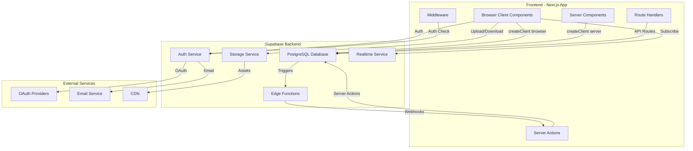

## Схема базы данных

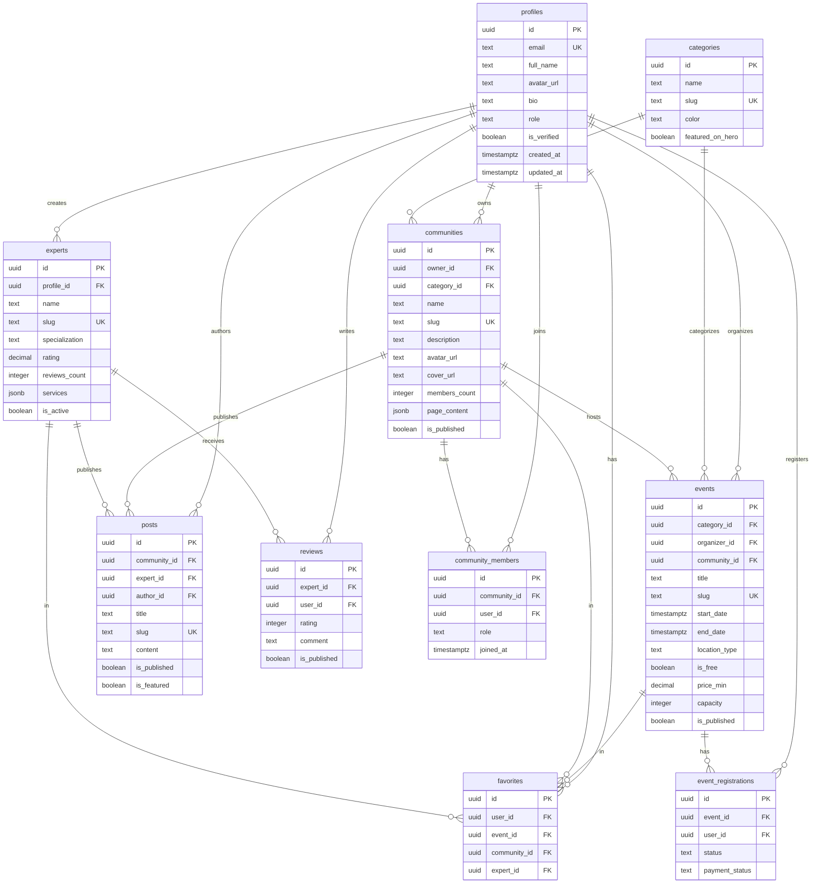

## Поток данных для событий

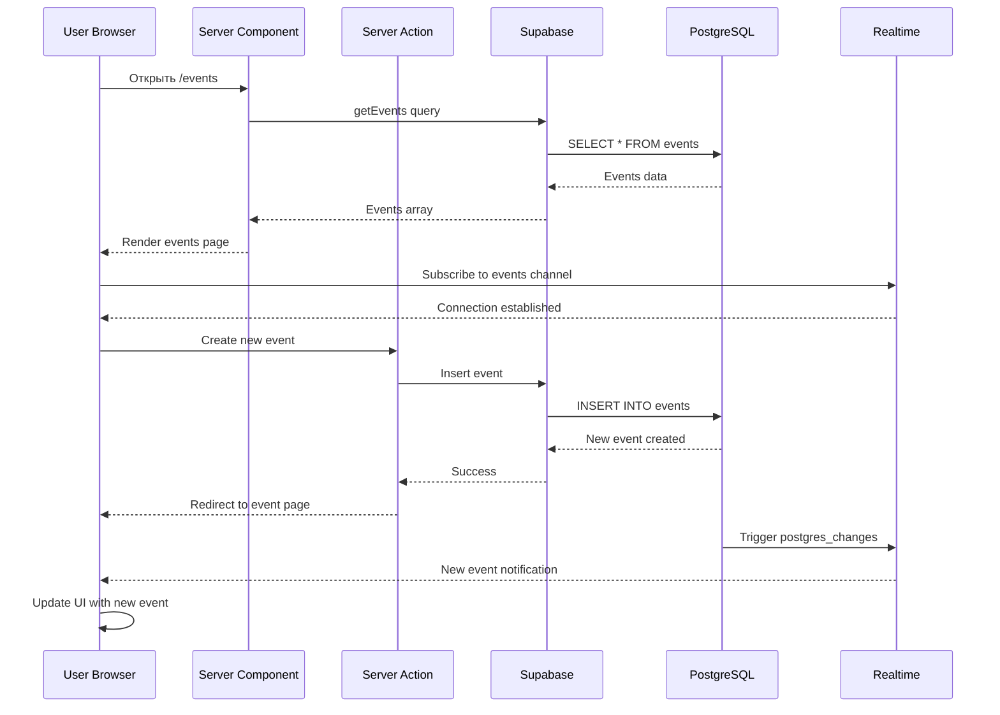

## Аутентификация и авторизация

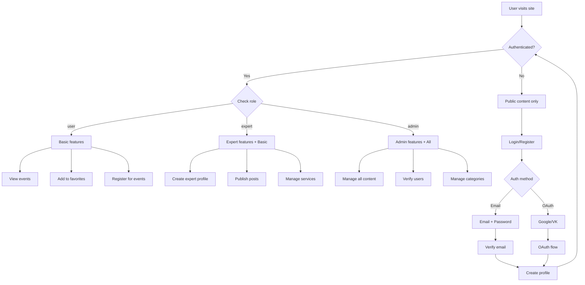

## Storage структура

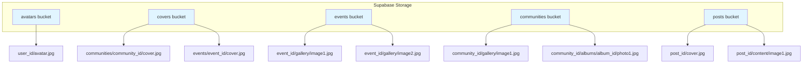

## RLS Политики - Примеры

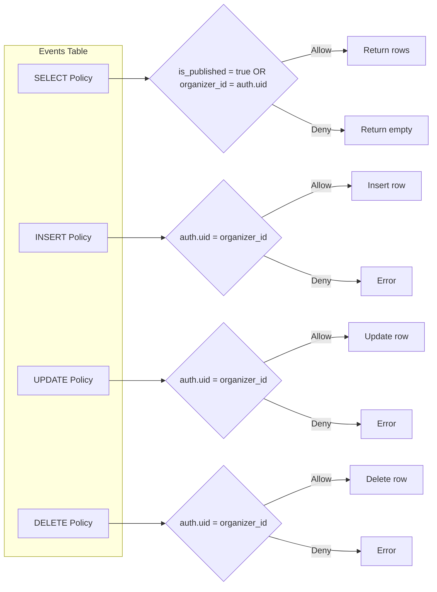

## Realtime подписки

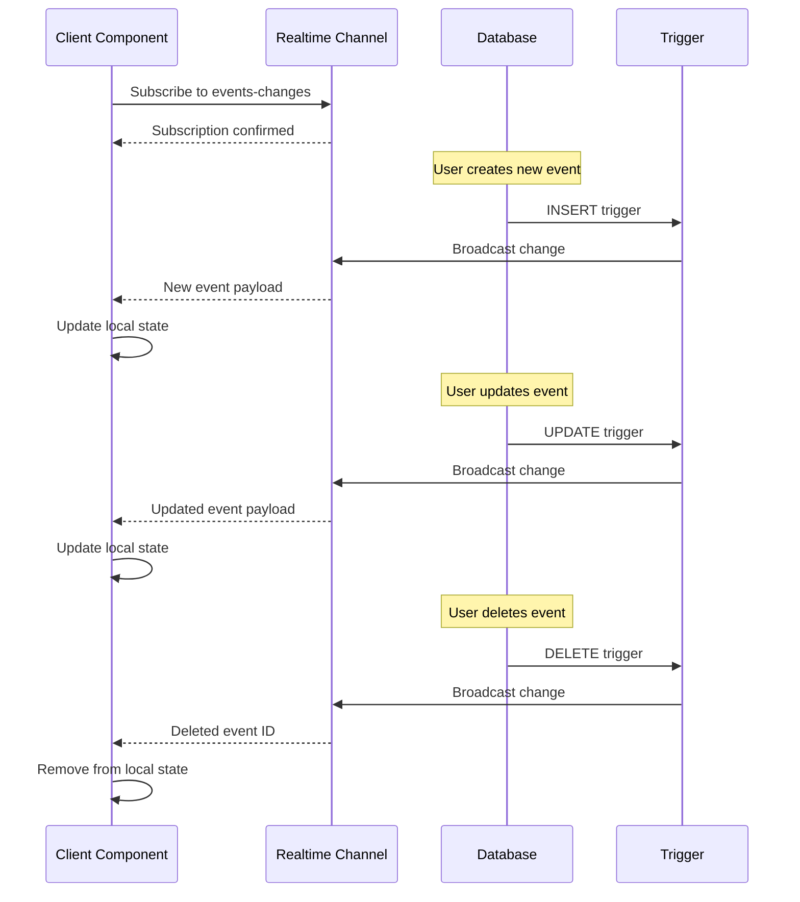

## Миграция данных - процесс

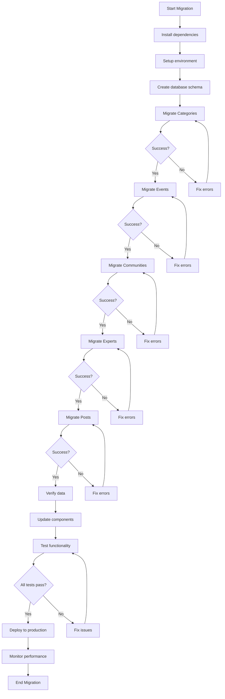

## Оптимизация запросов

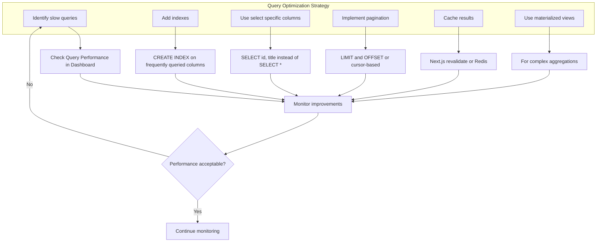

## Безопасность - многоуровневая защита

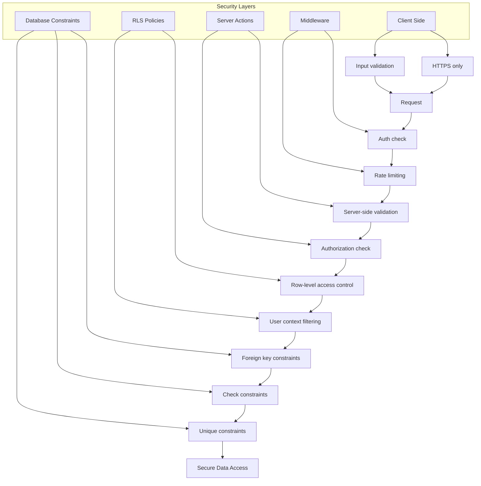

## Масштабирование стратегия

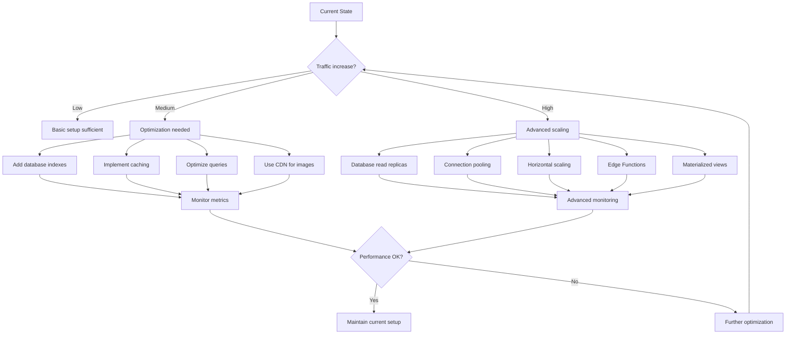

## Резервное копирование и восстановление

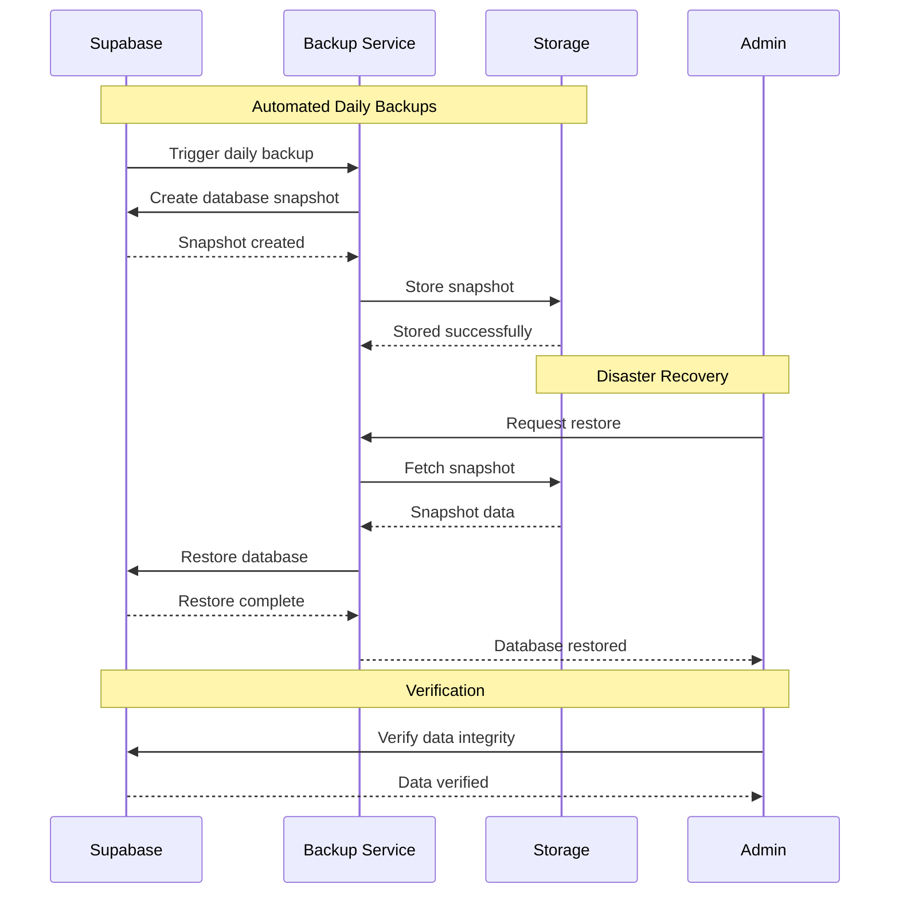

## Мониторинг и алерты

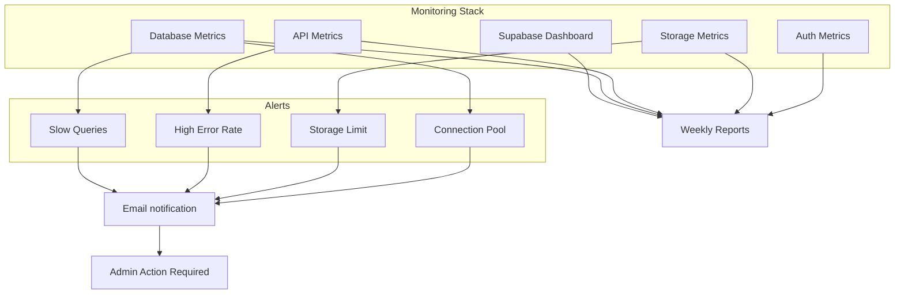

## Развертывание и CI/CD

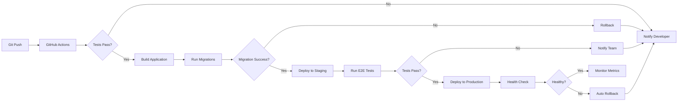

---

## Ключевые принципы архитектуры

### 1. Разделение ответственности
- **Frontend**: UI/UX, валидация форм, оптимистичные обновления
- **Backend**: Бизнес-логика, авторизация, хранение данных
- **Edge**: Кэширование, CDN, геораспределение

### 2. Безопасность на всех уровнях
- Client-side валидация (UX)
- Server-side валидация (безопасность)
- RLS политики (защита данных)
- Database constraints (целостность данных)

### 3. Производительность
- Индексы для быстрых запросов
- Кэширование на уровне Next.js
- CDN для статических ресурсов
- Оптимизация изображений

### 4. Масштабируемость
- Горизонтальное масштабирование через Supabase
- Stateless архитектура
- Микросервисы через Edge Functions
- Асинхронная обработка через очереди

### 5. Надежность
- Автоматические бэкапы
- Мониторинг и алерты
- Graceful degradation
- Error boundaries

---

## Технологический стек

### Frontend
- **Next.js 16** - React framework с App Router
- **TypeScript** - Типизация
- **Tailwind CSS** - Стилизация
- **CraftJS** - Page builder для сообществ

### Backend
- **Supabase** - BaaS платформа
- **PostgreSQL** - Реляционная БД
- **PostgREST** - Автоматический REST API
- **GoTrue** - Аутентификация

### DevOps
- **GitHub Actions** - CI/CD
- **Vercel/Amvera** - Хостинг
- **Supabase CLI** - Управление миграциями

### Мониторинг
- **Supabase Dashboard** - Метрики БД
- **Vercel Analytics** - Frontend метрики
- **Sentry** - Error tracking (опционально)

---

## Заключение

Данная архитектура обеспечивает:
- ✅ Безопасность через многоуровневую защиту
- ✅ Производительность через оптимизацию и кэширование
- ✅ Масштабируемость через правильную структуру
- ✅ Надежность через мониторинг и бэкапы
- ✅ Удобство разработки через TypeScript и современные инструменты