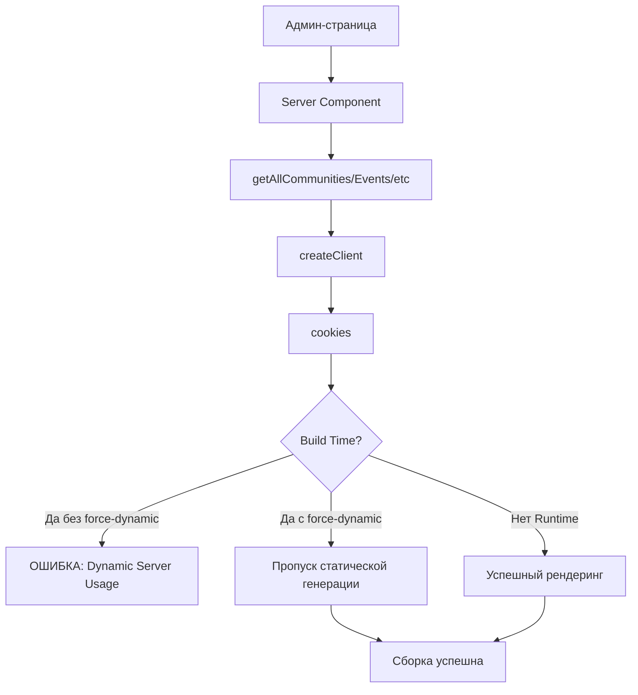

# План исправления ошибок сборки Next.js

## Проблемы

### 1. Предупреждение baseline-browser-mapping
```
[baseline-browser-mapping] The data in this module is over two months old. 
To ensure accurate Baseline data, please update: `npm i baseline-browser-mapping@latest -D`
```

### 2. Ошибки Dynamic Server Usage
```
Error checking admin status: Error: Dynamic server usage: Route /admin/communities 
couldn't be rendered statically because it used `cookies`. 
See more info here: https://nextjs.org/docs/messages/dynamic-server-error
```

## Анализ причин

### Причина ошибки с cookies

Все админ-страницы используют Server Components, которые вызывают функции из [`lib/supabase/admin.ts`](../lib/supabase/admin.ts):
- [`getAllCommunities()`](../lib/supabase/admin.ts:321)
- [`getAllEvents()`](../lib/supabase/admin.ts:356)
- [`getAllPosts()`](../lib/supabase/admin.ts:390)
- [`getAllExperts()`](../lib/supabase/admin.ts:428)
- [`getModerationStats()`](../lib/supabase/admin.ts:149)
- [`getModerationTasks()`](../lib/supabase/admin.ts:105)

Эти функции внутри вызывают [`createClient()`](../lib/supabase/server.ts:4) из [`lib/supabase/server.ts`](../lib/supabase/server.ts), который использует `cookies()` из Next.js.

**Проблема**: Next.js пытается статически сгенерировать эти страницы во время сборки (`next build`), но они используют динамические данные (cookies), что приводит к ошибке.

### Затронутые страницы

#### Админ-панель (критично)
1. [`app/admin/page.tsx`](../app/admin/page.tsx:4) - главная админ-панель
2. [`app/admin/communities/page.tsx`](../app/admin/communities/page.tsx:4) - управление сообществами
3. [`app/admin/events/page.tsx`](../app/admin/events/page.tsx:4) - управление событиями
4. [`app/admin/posts/page.tsx`](../app/admin/posts/page.tsx:4) - управление постами
5. [`app/admin/experts/page.tsx`](../app/admin/experts/page.tsx:4) - управление экспертами
6. [`app/admin/moderation/page.tsx`](../app/admin/moderation/page.tsx:4) - модерация

#### Dashboard (потенциально)
- [`app/dashboard/layout.tsx`](../app/dashboard/layout.tsx:6) - использует `createClient()` и `getUserRole()`
- Все страницы в `/dashboard/*` наследуют layout и могут иметь ту же проблему

## Решение

### 1. Обновить baseline-browser-mapping

```bash
npm install baseline-browser-mapping@latest -D
```

Это устранит предупреждение о устаревших данных.

### 2. Добавить force-dynamic для всех админ-страниц

Нужно добавить экспорт `dynamic = 'force-dynamic'` в каждую админ-страницу, чтобы явно указать Next.js, что эти страницы должны рендериться динамически, а не статически.

#### Изменения в файлах:

**[`app/admin/page.tsx`](../app/admin/page.tsx)**
```typescript
export const dynamic = 'force-dynamic';
```

**[`app/admin/communities/page.tsx`](../app/admin/communities/page.tsx)**
```typescript
export const dynamic = 'force-dynamic';
```

**[`app/admin/events/page.tsx`](../app/admin/events/page.tsx)**
```typescript
export const dynamic = 'force-dynamic';
```

**[`app/admin/posts/page.tsx`](../app/admin/posts/page.tsx)**
```typescript
export const dynamic = 'force-dynamic';
```

**[`app/admin/experts/page.tsx`](../app/admin/experts/page.tsx)**
```typescript
export const dynamic = 'force-dynamic';
```

**[`app/admin/moderation/page.tsx`](../app/admin/moderation/page.tsx)**
```typescript
export const dynamic = 'force-dynamic';
```

### 3. Оптимальное решение - добавить в layout

**РЕКОМЕНДУЕТСЯ**: Добавить `export const dynamic = 'force-dynamic'` в [`app/admin/layout.tsx`](../app/admin/layout.tsx):

```typescript
export const dynamic = 'force-dynamic';
```

**Преимущества**:
- Применяет динамический рендеринг ко всем страницам в директории `/admin`
- Не нужно добавлять в каждую страницу отдельно
- Layout уже использует `createClient()` и `isAdmin()`, которые требуют cookies
- Более чистое и поддерживаемое решение

**Альтернатива**: Если нужен более гранулярный контроль, можно добавить `force-dynamic` в каждую страницу отдельно.

### 4. Рекомендация для Dashboard

Также рекомендуется добавить `export const dynamic = 'force-dynamic'` в [`app/dashboard/layout.tsx`](../app/dashboard/layout.tsx):

```typescript
export const dynamic = 'force-dynamic';
```

**Причины**:
- Dashboard layout использует `createClient()` для получения пользователя
- Использует `getUserRole()`, который внутри вызывает `createClient()`
- Все страницы dashboard требуют аутентификации
- Предотвращает потенциальные ошибки при сборке

## Почему это работает

### Статический vs Динамический рендеринг в Next.js

**Статический рендеринг (по умолчанию)**:
- Страницы генерируются во время сборки (`next build`)
- HTML создается один раз и переиспользуется для всех запросов
- Быстрее, но не может использовать динамические данные (cookies, headers, searchParams)

**Динамический рендеринг**:
- Страницы генерируются для каждого запроса
- Может использовать cookies, headers, и другие динамические данные
- Необходим для страниц с аутентификацией

### Когда Next.js автоматически переключается на динамический рендеринг

Next.js автоматически делает страницу динамической, если она использует:
- `cookies()` или `headers()`
- `searchParams` в Page компонентах
- `useSearchParams()` без Suspense boundary

**Проблема**: Во время сборки Next.js пытается предварительно отрендерить страницу, но встречает вызов `cookies()`, который недоступен в build-time.

### Решение с `force-dynamic`

Добавление `export const dynamic = 'force-dynamic'` явно говорит Next.js:
- Не пытайся статически генерировать эту страницу
- Всегда рендери её динамически на сервере
- Cookies и другие динамические данные будут доступны

## Диаграмма потока данных



## Дополнительные рекомендации

### 1. Проверка других страниц

Проверьте другие страницы, которые могут использовать `cookies()`:
- Страницы дашборда
- Страницы профиля
- Любые страницы с аутентификацией

### 2. Оптимизация

Для страниц, которые не требуют аутентификации, рассмотрите:
- Использование Client Components для динамических частей
- Статическую генерацию с ISR (Incremental Static Regeneration)
- Кэширование данных

### 3. Мониторинг

После исправления проверьте:
```bash
npm run build
```

Убедитесь, что:
- Нет ошибок Dynamic Server Usage
- Админ-страницы помечены как динамические (λ) в выводе сборки
- Предупреждение baseline-browser-mapping исчезло

## Ожидаемый результат

После применения исправлений:

1. ✅ Предупреждение baseline-browser-mapping исчезнет
2. ✅ Ошибки Dynamic Server Usage исчезнут
3. ✅ Сборка проекта будет успешной
4. ✅ Админ-страницы будут работать корректно
5. ✅ Аутентификация через cookies будет работать

## Команды для применения

```bash
# 1. Обновить baseline-browser-mapping
npm install baseline-browser-mapping@latest -D

# 2. Применить изменения в файлах (через Code mode)
# Добавить export const dynamic = 'force-dynamic' в:
# - app/admin/layout.tsx (обязательно)
# - app/dashboard/layout.tsx (рекомендуется)

# 3. Проверить сборку
npm run build

# 4. Запустить проект
npm run start
```

## Приоритет исправлений

### Критично (обязательно)
1. ✅ Обновить `baseline-browser-mapping`
2. ✅ Добавить `force-dynamic` в [`app/admin/layout.tsx`](../app/admin/layout.tsx)

### Рекомендуется (предотвращение будущих проблем)
3. ⚠️ Добавить `force-dynamic` в [`app/dashboard/layout.tsx`](../app/dashboard/layout.tsx)

### Опционально (если проблемы сохраняются)
4. 🔧 Добавить `force-dynamic` в отдельные страницы, если layout не помогает

## Ссылки

- [Next.js Dynamic Rendering](https://nextjs.org/docs/app/building-your-application/rendering/server-components#dynamic-rendering)
- [Next.js Route Segment Config](https://nextjs.org/docs/app/api-reference/file-conventions/route-segment-config#dynamic)
- [Next.js Dynamic Server Error](https://nextjs.org/docs/messages/dynamic-server-error)
