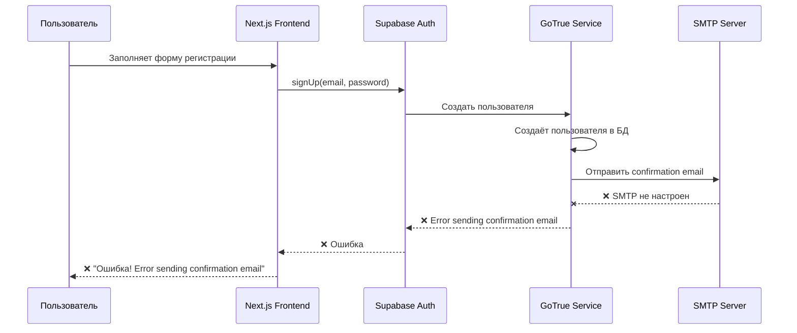
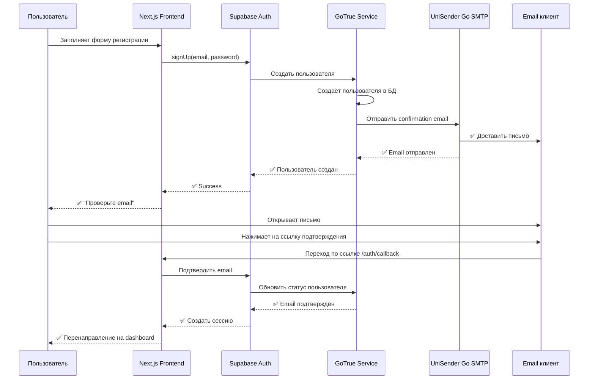
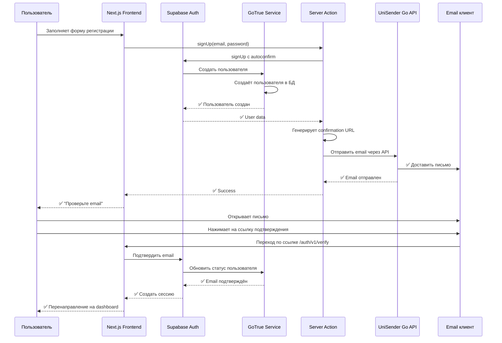
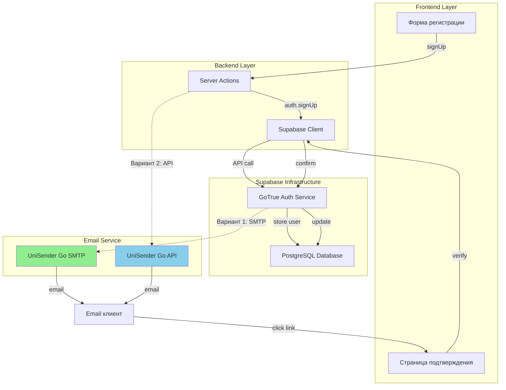
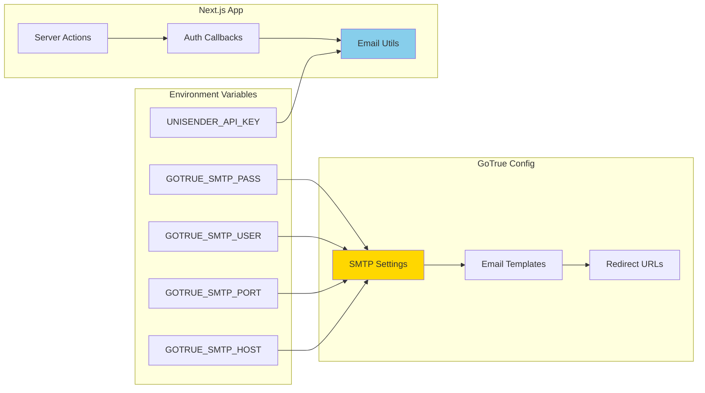

# 📊 Диаграммы процесса Email подтверждения

## 🔄 Текущий процесс (с ошибкой)

## ✅ Целевой процесс (Вариант 1: SMTP в GoTrue)

## 🔄 Альтернативный процесс (Вариант 2: API UniSender)

## 🏗️ Архитектура решения

## 🔧 Конфигурация компонентов

## 📝 Сравнение вариантов

| Критерий | Вариант 1: SMTP в GoTrue | Вариант 2: API UniSender |
|----------|--------------------------|--------------------------|
| **Сложность настройки** | Средняя | Низкая |
| **Интеграция с Supabase** | Полная | Частичная |
| **Контроль над шаблонами** | Ограниченный | Полный |
| **Поддержка всех типов email** | Автоматическая | Ручная |
| **Зависимость от Supabase** | Высокая | Низкая |
| **Гибкость** | Средняя | Высокая |
| **Рекомендуется для** | Production | Быстрый старт |

## 🎯 Рекомендация

**Для production рекомендуется Вариант 1** (SMTP в GoTrue), так как:
- ✅ Полная интеграция с Supabase Auth
- ✅ Автоматическая обработка всех типов email
- ✅ Меньше кода для поддержки
- ✅ Стандартный подход

**Вариант 2** (API UniSender) подходит для:
- 🔧 Быстрого прототипирования
- 🎨 Кастомных email шаблонов
- 🔄 Миграции с существующей системы
